# ESP32 E-Paper Quote Display

Display motivational quotes on a 7.5in E-Paper (aka E-ink) display. Powered by a wifi-enabled, low-power ESP32 microcontroller. Quotes are retrieved from a Google spreadsheet, allowing for quick and easy management of your collection of inspiring quotes.

The project draws ~14μA when sleeping and an estimated average of ~83mA during its ~15s wake period. The display can be configured to update as frequently as desired. When the refresh interval is set to 60 minutes, the device will run for >1 year on a single 5000mAh battery. A smaller battery will last many years if you only desire a daily quote. The project displays accurate battery life percentage and can be recharged via a USB-C cable connected to a wall adapter or computer.

This project is an adaptation of my open-source e-paper weather display project (https://github.com/lmarzen/esp32-weather-epd).

  
  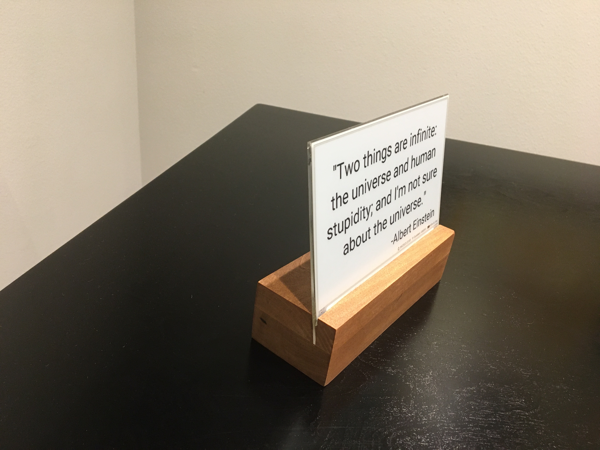
  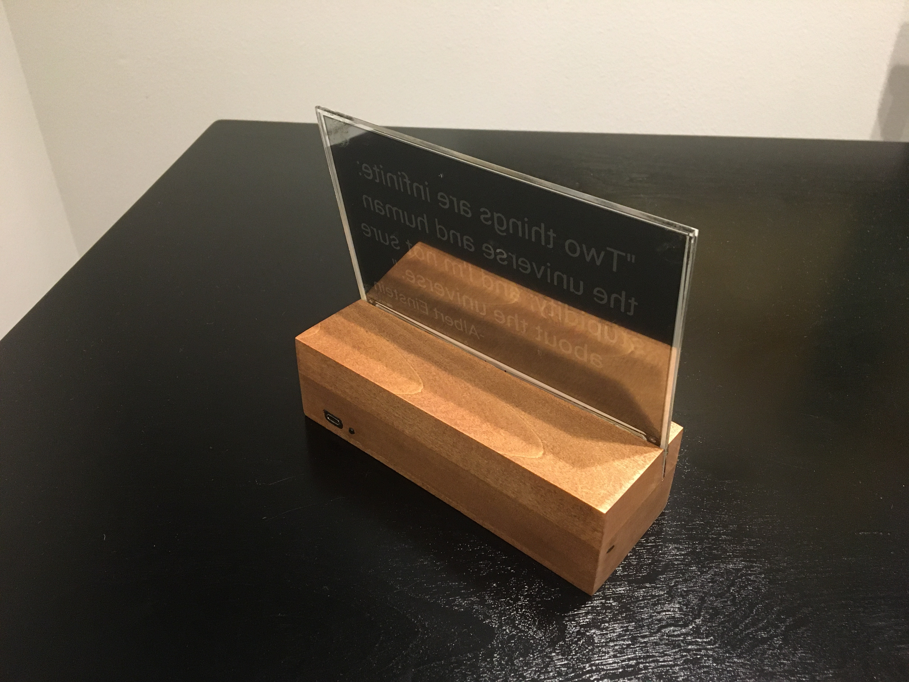
  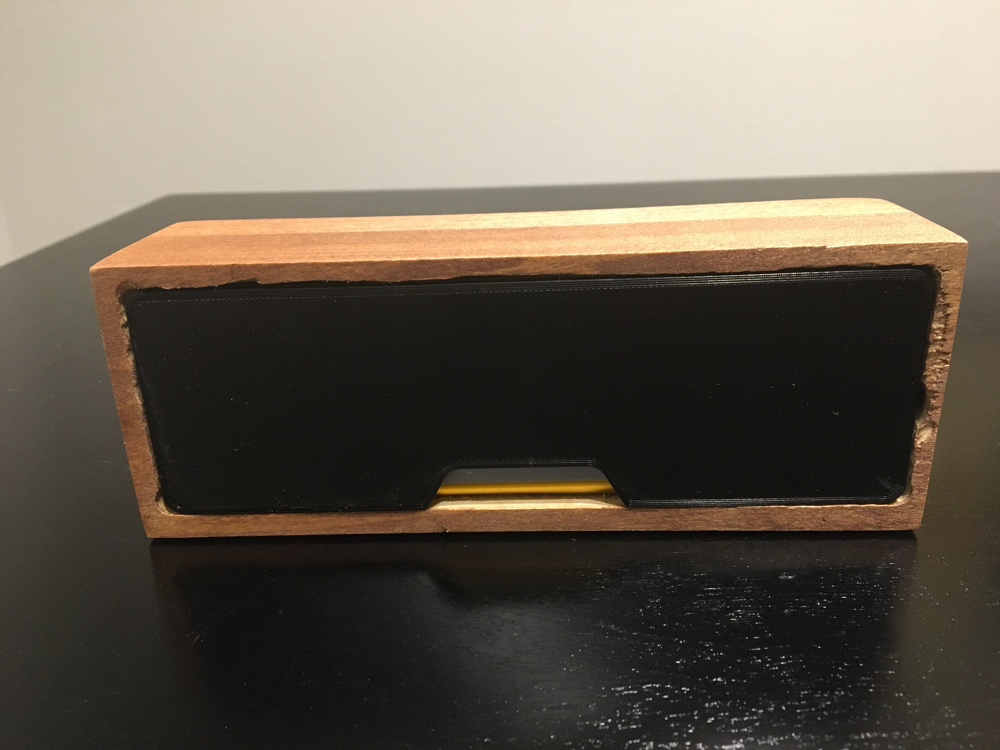
  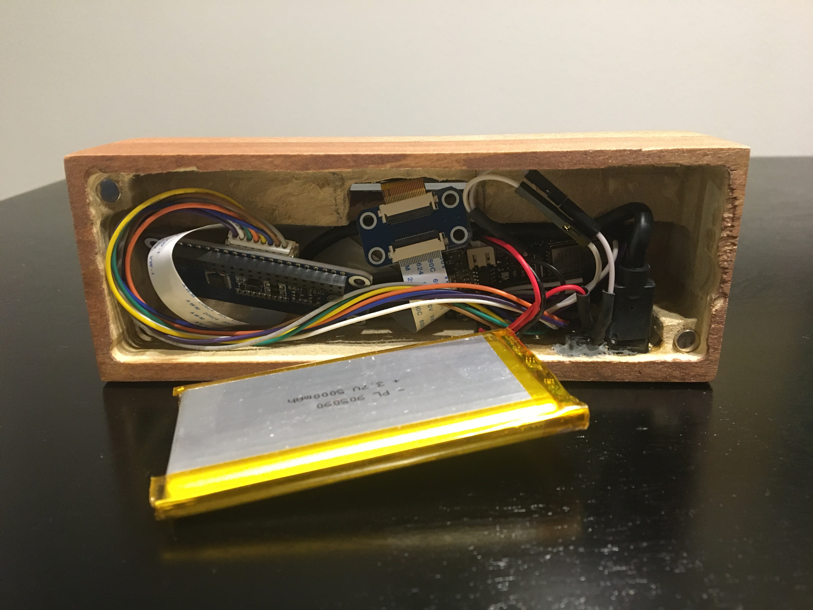

I made a small stand by hollowing out a piece of wood from the bottom. On the back, I used a short USB extension cable so that I can charge the battery without needing to remove the components from the stand. I also wired a small reset button to refresh the display manually. Additionally, I 3d printed a cover for the bottom, which is held on by magnets. The E-paper screen is very thin, so I used a thin piece of acrylic to support it.

## Features

Quotes are managed through a google spreadsheet.

The reset button can be used to manually cycle to the next quote.

Multiple quote selection options,

- Random - Choose a quote completely at random.
- Shuffle - Displays each quote once before shuffling them.
- Iterative - Loops through the quotes in order.

Quotes are automatically scaled to fit the screen optimally.

Alignment and font for quotes and authors can be controlled independently.

Support for multiple fonts, I have included a number of open-source fonts. If you want to add more, see [fonts/README](fonts/README).

Use different fonts depending on the length of the quote, or use the same font all around. Up to you!

Here are a handful of examples:

  
  
  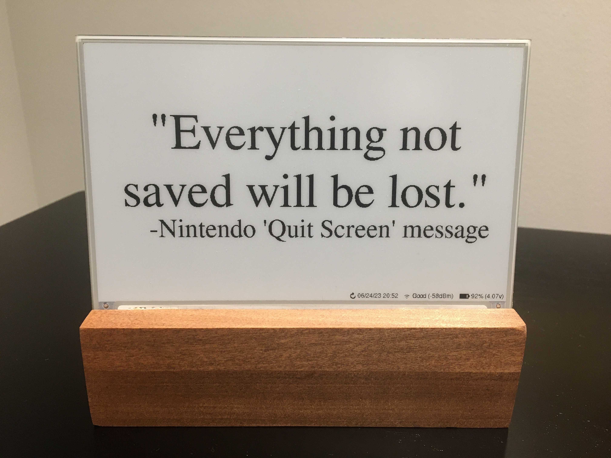
  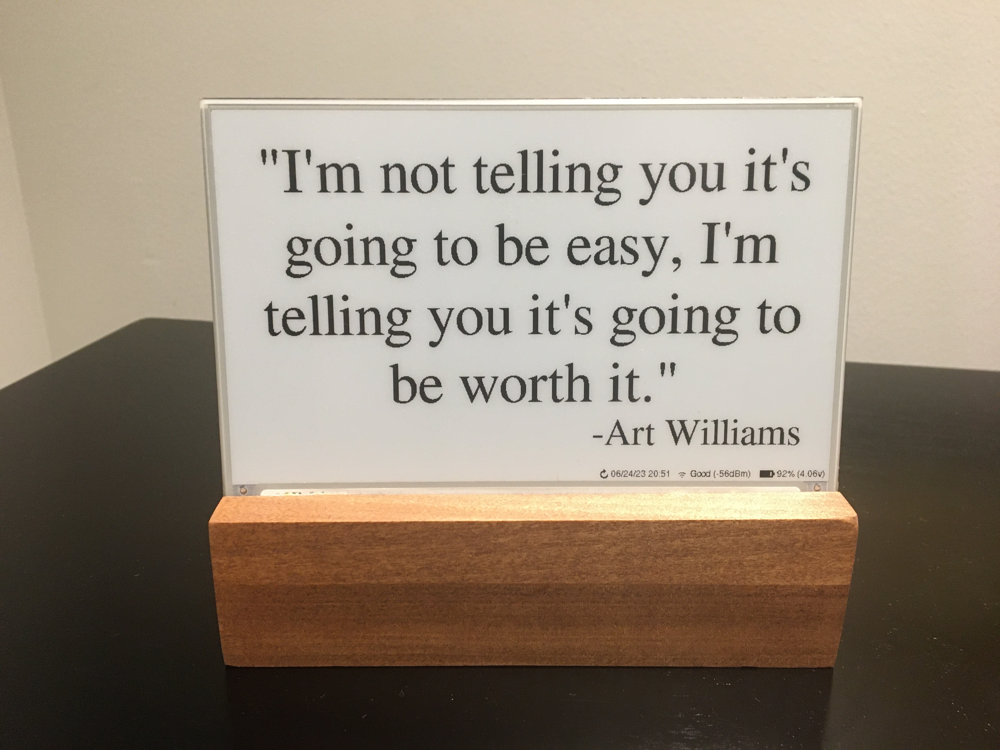

## Setup Guide

### Hardware

7.5inch (800×480) E-Ink Display w/ HAT for Raspberry Pi, SPI interface

- Advantages of E-Paper
  - Ultra Low Power Consumption - E-Paper (or E-Ink) displays are ideal for low-power applications that do not require frequent display refreshes. E-Paper displays only draw power when refreshing the display and do not have a backlight. Images will remain on the screen even when power is removed.

- Limitations of E-Paper:
  - Colors - E-Paper has traditionally been limited to just black and white, but in recent years 3-color E-Paper screens have started showing up.

  - Refresh Times and Ghosting - E-Paper displays are highly susceptible to ghosting effects if refreshed too quickly. To avoid this, E-Paper displays often take a few seconds to refresh(4s for the unit used in this project) and will alternate between black and white a few times, which can be distracting.

- https://www.waveshare.com/product/7.5inch-e-paper-hat.htm (800x480, 7.5inch E-Ink display, Black/White)

- Note that this project also now supports this 3-color panel as well. Some elements will be drawn with an accent color, at the cost of a longer refresh sequence. https://www.waveshare.com/product/7.5inch-e-paper-hat-b.htm (800x480, 7.5inch E-Ink display, Red/Black/White)

FireBeetle 2 ESP32-E Microcontroller

- Why the ESP32?

  - Onboard WiFi.

  - 520kB of RAM and 4MB of FLASH, enough to store lots of fonts.

  - Low power consumption.

  - Small size, many small development boards available.

- Why the FireBeetle 2 ESP32-E

  - Drobot's FireBeetle ESP32 models are optimized for low-power consumption (https://diyi0t.com/reduce-the-esp32-power-consumption/). The Drobot's FireBeetle 2 ESP32-E variant offers USB-C, but older versions of the board with Mirco-USB would work fine too.

  - Firebeelte ESP32 models include onboard charging circuitry for a 3.7v lithium-ion(LiPo) battery.

  - FireBeetle ESP32 models include onboard circuitry to monitor battery voltage of a battery connected to its JST-PH2.0 connector.

- https://www.dfrobot.com/product-2195.html

3.7V Lipo Battery w/ 2 Pin JST Connector

- Size is up to you. I used a 10000mah battery so that the device can operate on a single charge for >1 year.

- The battery can be charged by plugging the FireBeetle ESP32 into the wall via the USB-C connector while the battery is plugged into the ESP32's JST connector.

  > **Warning**
  > The polarity of JST-PH2.0 connectors is not standardized! You may need to swap the order of the wires in the connector.

### Wiring

Pin connections are defined in config.cpp.

If you are using the FireBeetle 2 ESP32-E, you can use the connections I used or change them how you would like.

IMPORTANT: The E-Paper Driver Hat has two physical switches that MUST be set correctly for the display to work.

- Display Config: Set switch to position B.

- Interface Config: Set switch to position 0.

Cut the low power pad for even longer battery life.

- From https://wiki.dfrobot.com/FireBeetle_Board_ESP32_E_SKU_DFR0654

  > Low Power Pad: This pad is specially designed for low power consumption. It is connected by default. You can cut off the thin wire in the middle with a knife to disconnect it. After disconnection, the static power consumption can be reduced by 500 μA. The power consumption can be reduced to 13 μA after controlling the maincontroller enter the sleep mode through the program. Note: when the pad is disconnected, you can only drive RGB LED light via the USB Power supply.

  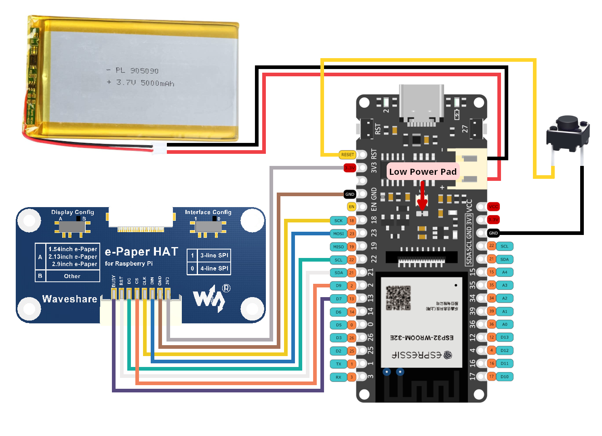

### Configuration, Compilation, and Upload

Clone this repository or download and extract the .zip.

Google Sheet

1. First, you will need to create a Google sheet and store your quotes in the first column (i.e. column A). (https://docs.google.com/spreadsheet)

2. Note down the Sheet ID, located in the URL. You will need to copy this into the Google Script you will set up next.

  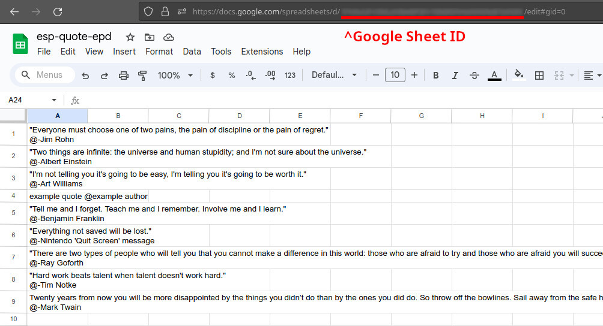

4. Optionally specify an author for each quote. The author is indicated with an at sign, '@'. If you really want to include an at sign in a quote, you must escape it first with a backslash, '\\@'.

5. You can force your own line breaks by starting new lines within the quotes cell using `Ctrl + Enter`. The author will always be displayed on a new line.

Google Script

1. Navigate to Google Apps Script. Google Apps Script enables us to create a script that can interact with the Google Sheet we just created.

  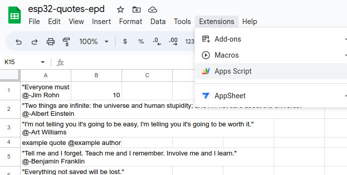

2. Paste the contents of [code.gs](code.gs) into a new Google script. Don't forget to update the `sheet_id` variable to the Google Sheet ID you obtained from your sheet's URL earlier.

  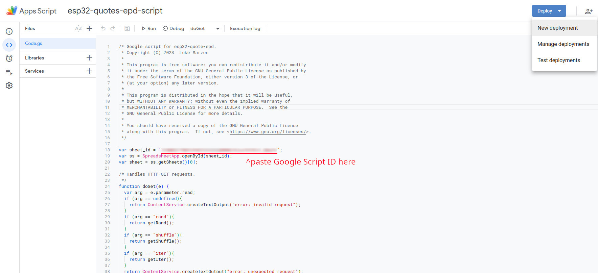

3. Deploy the script.

   a. In the top right corner, click `Deploy->New deployment`.

   b. Click the gear next to `Select type`, then select `Web app`.
   

  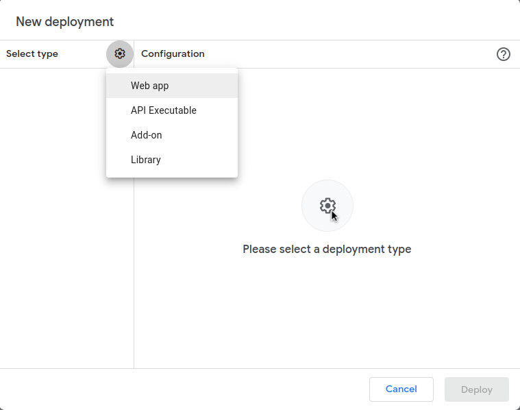

   c. Give a description, then set `Who has access` to `Anyone`.
   

  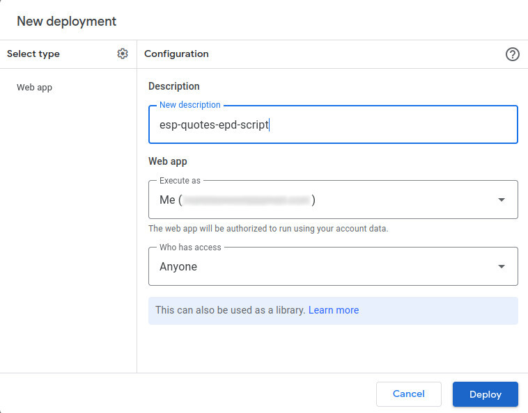

   d. Click `Authorize access`.
   

  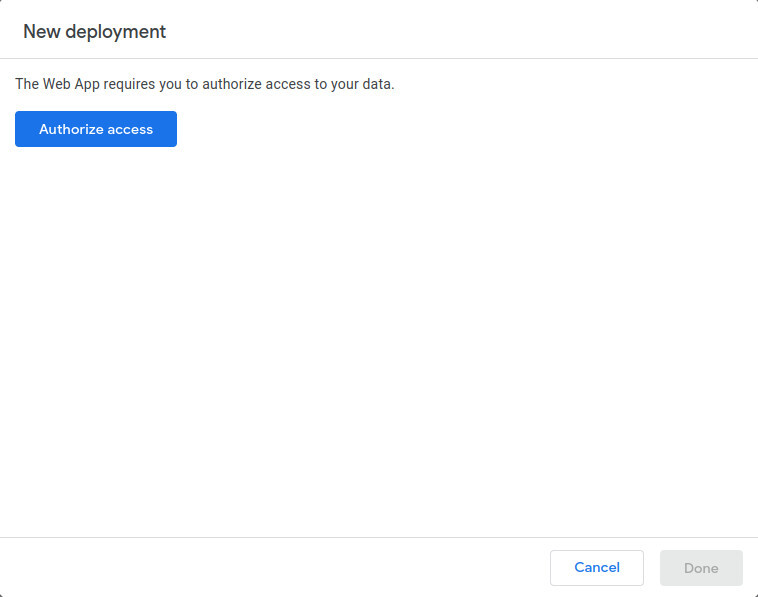

   e. Choose your account.
   

  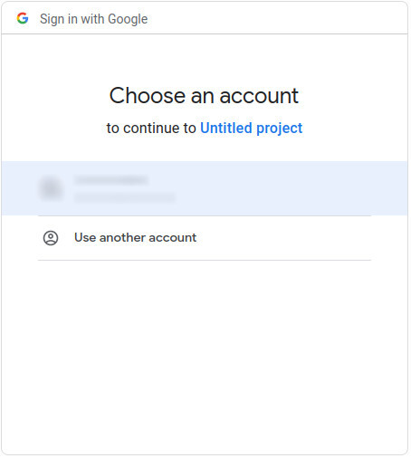

   f. Click `Show Advanced` then `Go to <project_name> (unsafe)`.
   

  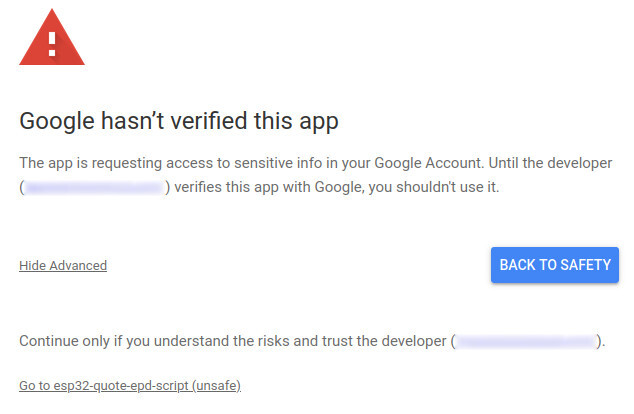

   g. Click `Allow`.
   

  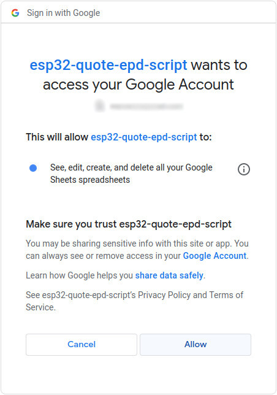

   h. Then copy the `Deployment ID`. You will need to update the GS_DEPLOYMENT_ID with this string in [config.cpp](platformio/src/config.cpp).
   

  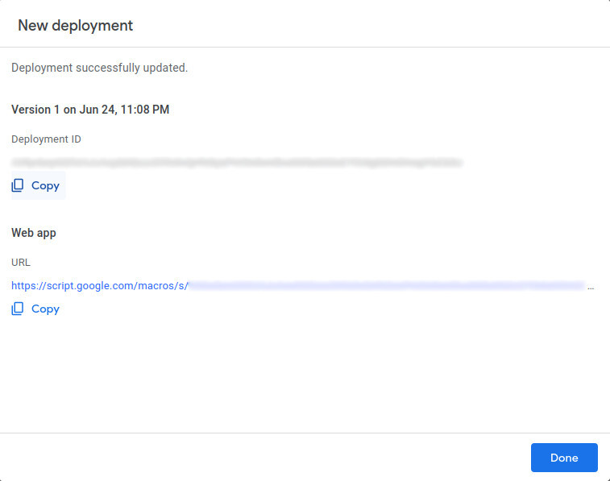

   

PlatformIO for VSCode is used for managing dependencies, code compilation, and uploading to ESP32.

1. Install VSCode.

2. Follow these instructions to install the PlatformIO extension for VSCode: https://platformio.org/install/ide?install=vscode

3. Open the project in VSCode.

   a. File > Open Folder...

   b. Navigate to this project and select the folder called "platformio".

4. Configure Options.

   - Most configuration options are located in [config.cpp](platformio/src/config.cpp), with a few  in [config.h](platformio/include/config.h).

   - Important settings to configure in config.cpp:

     - WiFi credentials (ssid, password).

     - Google script deployment ID.

     - Sleep duration.

     - Pin connections for E-Paper (SPI), and battery voltage (ADC).

   - Important settings to configure in config.h:

     - Fonts.

   - Comments explain each option in detail.

5. Build and Upload Code.

   a. Connect ESP32 to your computer via USB.

   b. Click the upload arrow along the bottom of the VSCode window. (Should say "PlatformIO: Upload" if you hover over it.)

      - PlatformIO will automatically download the required third-party libraries, compile, and upload the code. :)

      - You will only see this if you have the PlatformIO extension installed.

      - If you are getting errors during the upload process, you may need to install drivers to allow you to upload code to the ESP32.

## Licensing

esp32-quote-epd is licensed under the [GNU General Public License v3.0](LICENSE) with tools, fonts, and icons whose licenses are as follows:

| Name | License | Description |
|---------------------------------------------------------------------------------------------------------------|---------------------------------------------------------------------------------------|------------------------------------------------------------------------------------|
| [Adafruit-GFX-Library: fontconvert](https://github.com/adafruit/Adafruit-GFX-Library/tree/master/fontconvert) | [BSD License](fonts/fontconvert/license.txt) | CLI tool for preprocessing fonts to be used with the Adafruit_GFX Arduino library. |
| [GNU FreeFont](https://www.gnu.org/software/freefont/) | [GNU General Public License v3.0](https://www.gnu.org/software/freefont/license.html) | Font Family |
| [Lato](https://fonts.google.com/specimen/Lato) | [SIL OFL 1.1](http://scripts.sil.org/OFL) | Font Family |
| [Montserrat](https://fonts.google.com/specimen/Montserrat) | [SIL OFL 1.1](http://scripts.sil.org/OFL) | Font Family |
| [Open Sans](https://fonts.google.com/specimen/Open+Sans) | [SIL OFL 1.1](http://scripts.sil.org/OFL) | Font Family |
| [Poppins](https://fonts.google.com/specimen/Poppins) | [SIL OFL 1.1](http://scripts.sil.org/OFL) | Font Family |
| [Quicksand](https://fonts.google.com/specimen/Quicksand) | [SIL OFL 1.1](http://scripts.sil.org/OFL) | Font Family |
| [Raleway](https://fonts.google.com/specimen/Raleway) | [SIL OFL 1.1](http://scripts.sil.org/OFL) | Font Family |
| [Roboto](https://fonts.google.com/specimen/Roboto) | [Apache License v2.0](https://www.apache.org/licenses/LICENSE-2.0) | Font Family |
| [Roboto Mono](https://fonts.google.com/specimen/Roboto+Mono) | [Apache License v2.0](https://www.apache.org/licenses/LICENSE-2.0) | Font Family |
| [Roboto Slab](https://fonts.google.com/specimen/Roboto+Slab) | [Apache License v2.0](https://www.apache.org/licenses/LICENSE-2.0) | Font Family |
| [Ubuntu font](https://design.ubuntu.com/font) | [Ubuntu Font Licence v1.0](https://ubuntu.com/legal/font-licence) | Font Family |
| [Weather Themed Icons](https://github.com/erikflowers/weather-icons) | [SIL OFL 1.1](http://scripts.sil.org/OFL) | (wi-**.svg) Weather icon family by Lukas Bischoff/Erik Flowers. |
| [Google Icons](https://fonts.google.com/icons) | [Apache License v2.0](https://www.apache.org/licenses/LICENSE-2.0) | (battery**.svg) Battery icons from Google Icons. |
| [Phosphor Icons](https://github.com/phosphor-icons/homepage) | [MIT License](http://opensource.org/licenses/mit-license.html) | (wifi**.svg, warning_icon.svg, error_icon.svg) WiFi, Warning, and Error icons from Phosphor Icons. |

